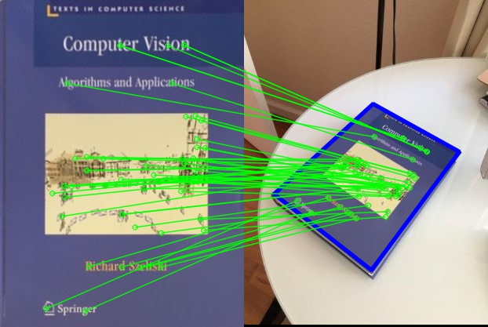
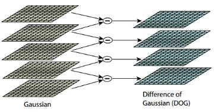

# Scale-Invariant Feature Transform

## Introduction

One of the more interesting problems in the field of computer vision is the task of finding good keypoints in images, i.e., distinct locations in an image that allow for the relation of two or more images. A good set of keypoints forms the basis for a deeper analysis of visual information and plays a crucial role in tasks such as optical flow estimation, object tracking, and even 3D reconstruction based on images. Finding such features is non-trivial and requires a robust computational model with low uncertainty. Several interesting approaches have been proposed over the years, such as Canny's edge detector and Harris' corner detector; however, it is the *Scale-Invariant Feature Transform (SIFT)* that has established itself as one of the most widely used algorithms. Compared to the former two algorithms, which are prone to being affected by noise and may miss information, SIFT robustly detects features across different scales and resolutions. The features detected are known as *blobs*, regions in an image with approximately constant properties compared to the rest of the image. In a specially processed image, a blob looks something like this:

Once the features have been detected, they need to be described in a way that allows matching of said features across images. In other words, using the created description, we wish to find features that are present in both images, also known as *correspondences*, and use this to relate the images. The final outcome of such matching is illustrated in fiugre \ref{fig2}.

While the *OpenCV* library provides an efficient pre-coded version of the SIFT algorithm, and many other feature detectors, it leaves out all the details about the algorithm's inner workings. My aim is thus to understand in detail the process of feature detection and matching, and I am doing so by utilizing the functionality of OpenCV and the C++ programming language to build a working version of SIFT from the bottom up. The goal is to achieve similar detection ability within a reasonable amount of time, preferably the same magnitude of runtime as the OpenCV version. In the following section we will take a thorough look at the algorithimc backbone of the SIFT algorithm. Before proceeding, it is assumed that the reader is familiar with the methods used in the field of computer vision.

## Method
The SIFT is a method comprised of two main parts: The first part is the detection of blob features in the provided image(-s), and the second step is concerned with creating descriptors for each of the detected features. Both of these steps involve running of several algorithms which form the basis of SIFT. In the following section I will dive into the intuition behind each of the steps in the algorithm. For brevity, matematical notation will be left out, however the reader will be pointed to relevant sources for more details. The terms *pyramid* and *scale-space* will be used interchangeably below.

### Step I: Detection of points

#### Creating the Guassian scale space
The capacity of the SIFT algorithm to detect features across scales, encompassing various levels of resolution and image blur, is attributed to the utilization of image pyramids within the detection process. In image processing, an image pyramid denotes a multi-scale image representation, where each image in the pyramid undergoes filtering and downsampling relative to the original image. In the context of the SIFT algorithm, the input image undergoes sequential blurring with a range of Gaussian kernels, generating multiple scales, denoted as m, before it undergoes downsampling, with the blurring process being iteratively applied. With each downsampling step, the final image from the preceding octave (a level within the pyramid comprising images of identical resolution) serves as the input for the subsequent octave. The process of constructing the Gaussian scale space is elegantly depicted in Figure \ref{fig3}. The end result is a scale-space construct with m scales and n octaves.

#### Approximation of the Laplacian of the scale-space
The original paper on SIFT [Ref here] defines keypoint features as the extreme points in the normalized Laplacian scale-space, representing the second derivative of the scale-space. However, computing the Laplacian space is inefficient. Fortunately, it can be approximated using the Difference-of-Gaussians (DoG) approach at a lower computational cost. To construct the DoG scale-space, one must first generate a Gaussian scale-space by repeatedly convolving the input image with Gaussian kernels at different scales. Then, the DoG scale-space is obtained by performing element-wise subtraction of two consecutive images in the Gaussian scale-space at each octave and storing the resulting image in a new pyramid. This process is illustrated in Figure \ref{fig3}. The DoG images highlight regions of significant change in intensity, aiding in the identification of potential keypoints. 

#### Detection and refinement of keypoints
After the creation of the DoG scale space, the initial candidate keypoints are identified by scanning each image in the DoG pyramid for extrema points. An extrema is defined as the maximum or minimum pixel value within a 3x3 window across the current and adjacent scales, i.e. previous and next scale in the current octave. The gathered points are then filtered using a threshold value *C~DoG~* to eliminate points with low contrast, hopefully removing false detections. The proceeding step involves a second stage of filtering, this time focused on removing candidate points located at the edges. This filtering procedure involves the computation of a *2D Hessian* matrix in the Dog scale space and a measure of *edgeness* defined as the ratio between the trace and determinant of said hessian matrix. If the value of edgeness exceeds the following ratio: 

$$\frac{(C_{\text{edge}} + 1)^2}{C_{\text{edge}}}$$

The point is discarded from the list of candidate points. Following this two stage elimination of false detections, the location of the keypoints in the input image is computed using quadratic interpolation. For a detailed algorithmic and mathematical description, I highly recommend reading the original paper and the *Anatomy of the SIFT method* article.

### Step II: Comptuing the decriptor of the keypoints

### Results

### Conclusion

### References

