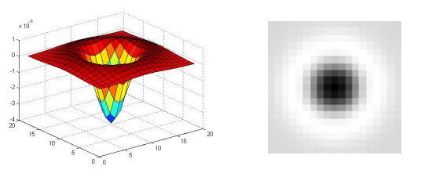

# Scale-Invariant Feature Transform

### Introduction

One of the more interesting problems in the field of computer vision is the task of finding good keypoints in images, i.e., distinct locations in an image that allow for the relation of two or more images. A good set of keypoints forms the basis for a deeper analysis of visual information and plays a crucial role in tasks such as optical flow estimation, object tracking, and even 3D reconstruction based on images. Finding such features is non-trivial and requires a robust computational model with low uncertainty. Several interesting approaches have been proposed over the years, such as Canny's edge detector and Harris' corner detector; however, it is the *Scale-Invariant Feature Transform (SIFT)* that has established itself as one of the most widely used algorithms. Compared to the former two algorithms, which are prone to being affected by noise and may miss information, SIFT robustly detects features across different scales and resolutions. The features detected are known as *blobs*, regions in an image with approximately constant properties compared to the rest of the image. In a specially processed image, a blob looks something like in this picture: 

### Method

### Results

### Conclusion

