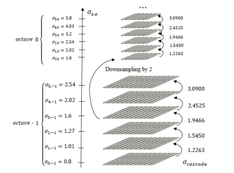

# Scale-Invariant Feature Transform

## Introduction

One of the more interesting problems in the field of computer vision is the task of finding good keypoints in images, i.e., distinct locations in an image that allow for the relation of two or more images. A good set of keypoints forms the basis for a deeper analysis of visual information and plays a crucial role in tasks such as optical flow estimation, object tracking, and even 3D reconstruction based on images. Finding such features is non-trivial and requires a robust computational model with low uncertainty. Several interesting approaches have been proposed over the years, such as Canny's edge detector and Harris' corner detector; however, it is the *Scale-Invariant Feature Transform (SIFT)* that has established itself as one of the most widely used algorithms. Compared to the former two algorithms, which are prone to being affected by noise and may miss information, SIFT robustly detects features across different scales and resolutions. The features detected are known as *blobs*, regions in an image with approximately constant properties compared to the rest of the image. In a specially processed image, a blob looks something like this:

Once the features have been detected, they need to be described in a way that allows matching of said features across images. In other words, using the created description, we wish to find features that are present in both images, also known as *correspondences*, and use this to relate the images. The final outcome of such matching is illustrated in fiugre \ref{fig2}.

While the *OpenCV* library provides an efficient pre-coded version of the SIFT algorithm, and many other feature detectors, it leaves out all the details about the algorithm's inner workings. My aim is thus to understand in detail the process of feature detection and matching, and I am doing so by utilizing the functionality of OpenCV and the C++ programming language to build a working version of SIFT from the bottom up. The goal is to achieve similar detection ability within a reasonable amount of time, preferably the same magnitude of runtime as the OpenCV version. In the following section we'll take a thorough look at the algorithimc backbone of the SIFT algorithm.

## Method
The SIFT is a method comprised of two main parts: The first part is the detection of blob features in the provided image(-s), and the second step is concerned with creating descriptors for each of the detected features. Both of these steps involve running of several algorithms which form the basis of SIFT. In the following section I will dive into the intuition behind each of the steps in the algorithm. For brevity, matematical notation will be left out, however the reader will be pointed to relevant sources for more details.

### Step I: Detection of points

#### Creating the Guassian scale space
The capacity of the SIFT algorithm to detect features across scales, encompassing various levels of resolution and image blur, is attributed to the utilization of image pyramids within the detection process. In image processing, an image pyramid denotes a multi-scale image representation, where each image in the pyramid undergoes filtering and downsampling relative to the original image. In the context of the SIFT algorithm, the input image undergoes sequential blurring with a range of Gaussian kernels, generating multiple scales, denoted as m, before it undergoes downsampling, with the blurring process being iteratively applied. With each downsampling step, the final image from the preceding octave (a level within the pyramid comprising images of identical resolution) serves as the input for the subsequent octave. The process of constructing the Gaussian scale space is elegantly depicted in Figure \ref{fig3}.

#### Approximation of the Laplacian of the scale-space

### Results

### Conclusion

### References

